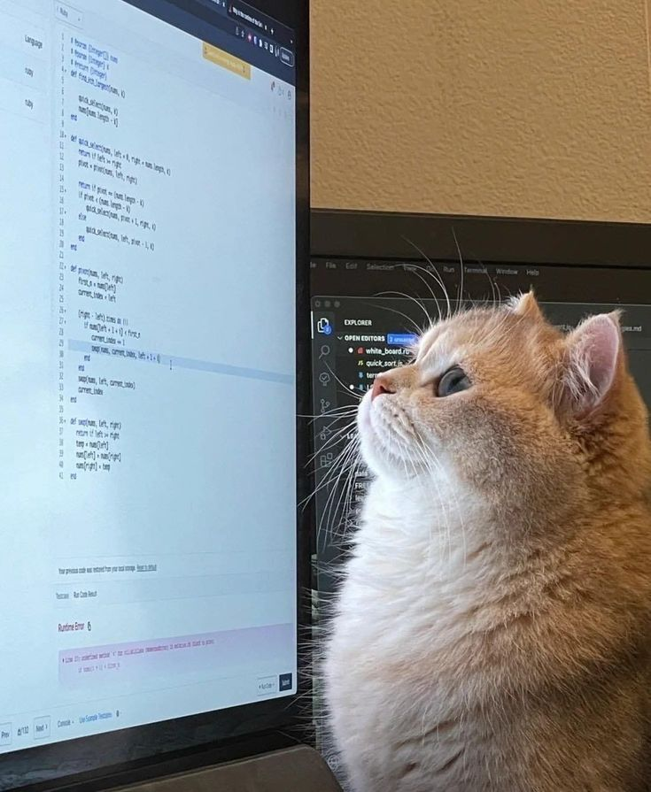

<table>
  <tr>
    <td style="width: 50%;">
       
    </td>
    <td style="width: 50%; vertical-align: top;">
      
 

        
     𝙈𝙖𝙧𝙘𝙤𝙨 𝙆𝙖𝙪𝙖̃

    /𝐀𝐁𝐎𝐔𝐓 𝐌𝐄
    │
    ├── /𝐁𝐈𝐎
    │    ├── HE/HIM - Brazilian
    │    ├── Sistemas de Informação
    │
    ├── /𝐎𝐒
    │    ├── /Linux (main)
    │    │   └── UBUNTU_v24.04-LTS
    │    └── /Windows
    │        └── /Windows_11
    │
    ├── /𝐒𝐓𝐀𝐂𝐊
    │    ├── /MySQl e NoSQL
    │    │   └── (PostgreSQL, SQL, h2, MariaDB and MongoDB)
    │    ├── Java
    │    ├── Spring Boot
    │    ├── Docker
    │    ├── Node.js
    │    ├── NestJs
    │    ├── Express
    │    ├── React
    │    ├── TypeScript
    │    ├── Figma
    │    └── Study Angular
    │
    └── /𝐈𝐃𝐄𝐬
        ├── IntelliJ
        ├── Vscode
        ├── Eclipse
        
  </tr>
</table>

  
 𝑪𝒐𝒅𝒆 𝑺𝒕𝒂𝒕𝒔 ━━━━━━━━━━━━━━━━━━━━━━━━━━━━━━━━━━━━━━━━━━━━━━ ━ ━━━

   
  

    

   

  

   

